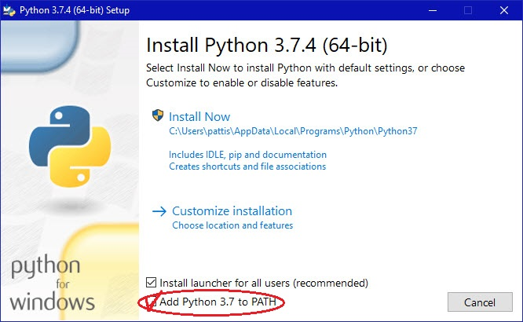
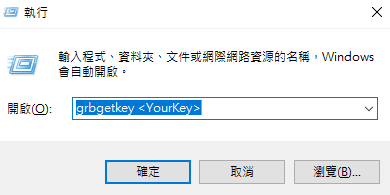
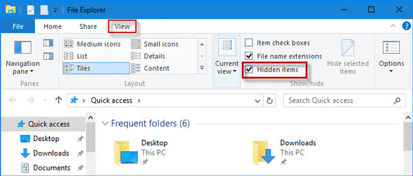
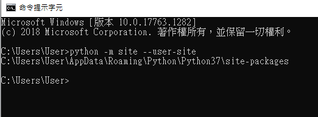
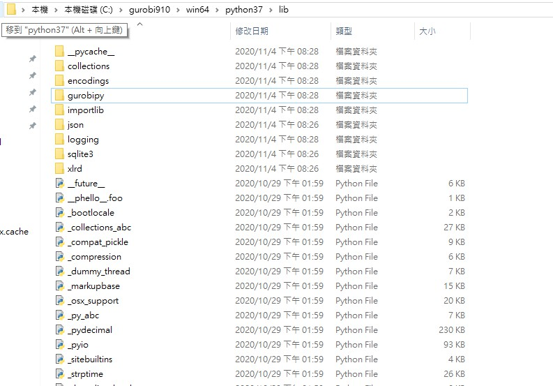
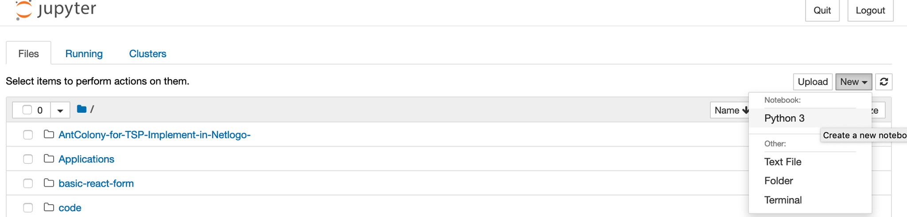
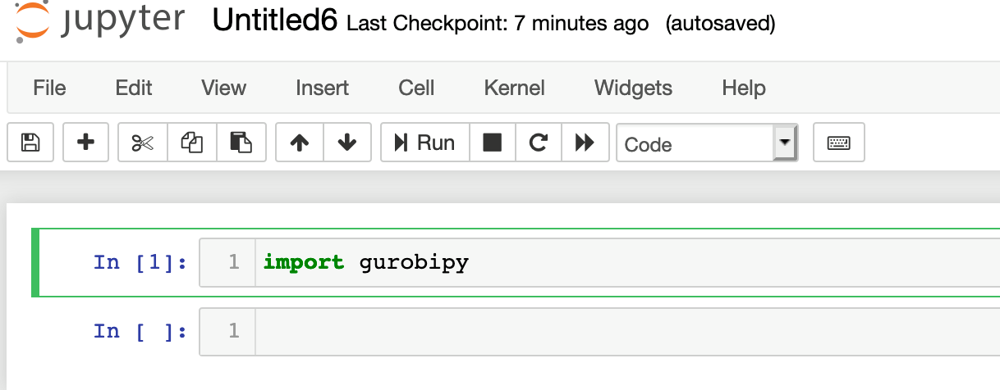

# Python-Gurobi-Installation-Without-Anaconda for Windows 64 bit


#### 1. Download and Install Python 3.7 64 bit for windows from [here](https://www.python.org/ftp/python/3.7.7/python-3.7.7.exe)
****** Notice that don't forget to Choose  "add python to path" 

#### 2. Open your terminal and run 
```pip install jupyter```

-------------------------------------------------------

#### 3. Register and Get your Gurobi Licence from [here](https://www.gurobi.com/downloads/end-user-license-agreement-academic/) (for Academic used only)

#### 4. Download Gurobi software from [here](https://www.gurobi.com/downloads/gurobi-software/)

#### 5. Open your command window and run ```grbgetkey <your licence>``` to activate your licence (in this step, make sure you are using academic network)


#### 6. Enable your File Explorer to show hidden items  


#### 7. Paste the folder to your Python library path e.g.(C:\Users\User\AppData\Local\Programs\Python\Python37\Lib\site-packages), you can find the path via running this ```python -m site --user-site``` in your command line.
    

#### 8. Find the gurobipy folder in Python 3.7 version in your disc (Default in C:\gurobi901\win64) and copy it into Python library path.


#### 9. Open a new terminal window and run ```jupyter notebook``` to launch your Python IDE.

#### 10. Create a new Python file in Jupyter UI and run ```from gurobipy import *``` to test if your enviorment is installed successfully.


