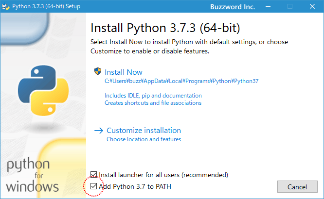

# Python-Gurobi-Installation-Without-Anaconda for Windows 64 bit

#### 1. Download and Install Python 3.7 64 bit for windows from [here](https://www.python.org/ftp/python/3.7.7/python-3.7.7.exe)
****** Notice that don't forget to Choose  "add python to path" 

#### 2. Open your command window and run 
'''pip install jupyter'''
