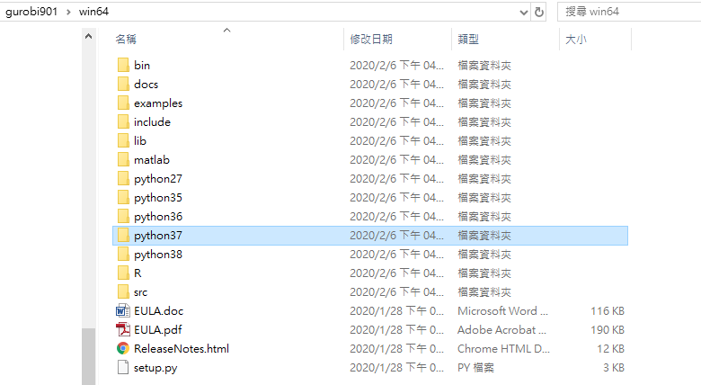

# Python-Gurobi-Installation-Without-Anaconda for Windows 64 bit


#### 1. Download and Install Python 3.7 64 bit for windows from [here](https://www.python.org/ftp/python/3.7.7/python-3.7.7.exe)
****** Notice that don't forget to Choose  "add python to path" 

#### 2. Open your command window and run 
```pip install jupyter```

-------------------------------------------------------

#### 3.1 Register and Get your Gurobi Licence from [here](https://www.gurobi.com/downloads/end-user-license-agreement-academic/) (for Academic used only)

#### 3.2 Open your command window and run ```grbgetkey <yourlicence>``` to activate your licence (in this step, make sure you are using academic network)

#### 4. Download Gurobi software from [here](https://www.gurobi.com/downloads/gurobi-software/)

#### 5. Find the Gurobi Python 3.7 folder in your disc (Default in C:\gurobi901\win64) and copy it.


#### 6. Paste the folder to your Python library path e.g.(C:\Users\User\AppData\Local\Programs\Python\Python37\Lib\site-packages), you can find the path via running this ```python -m site --user-site``` in your command line.
  
Note: Ensure your File Explorer can see hidden items


#### 7. Open a new command window and run ```jupyter notebook``` to launch your Python IDE.

#### 8. Create a new python file in Jupyter UI and run ```import gurobipy``` to test if your enviorment is installed successfully.


